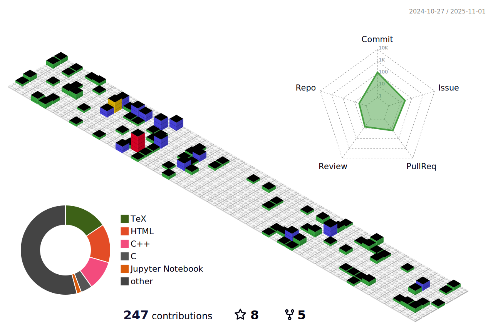

### Hi there 👋

I'm a Cybernetics and Robotics Master's student at NTNU 🤖. I work part-time with teaching and drone research. In my spare time I like to tinker with robotics projects such as tracking turrets and autonomous delivery robots. 

<!--
**tordnat/tordnat** is a ✨ _special_ ✨ repository because its `README.md` (this file) appears on your GitHub profile.

Here are some ideas to get you started:

- 🔭 I’m currently working on ...
- 🌱 I’m currently learning ...
- 👯 I’m looking to collaborate on ...
- 🤔 I’m looking for help with ...
- 💬 Ask me about ...
- 📫 How to reach me: ...
- 😄 Pronouns: ...
- ⚡ Fun fact: ...
-->

